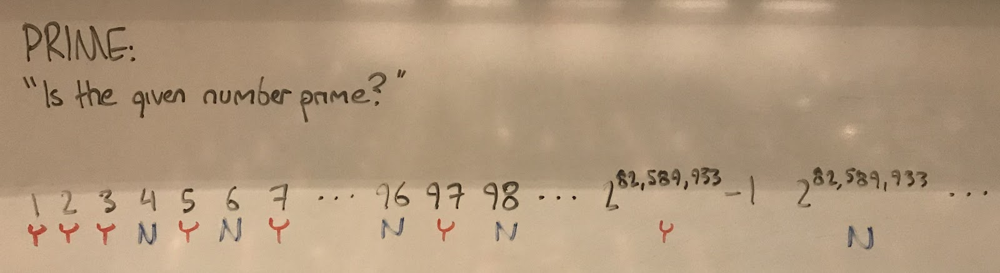

### Introduction

_Computational complexity is the study of how difficult problems are._ In the same way that physics is not about building better rockets, but understanding the natural principles behind rocket construction, computational complexity is not about building better algorithms! Rather, it’s studying problems _themselves_ as separate, natural entities. [[^1]] Broadly speaking, we assign problems to classes denoted by inscrutable series of capital letters (**P, NP, PSPACE, EXPTIME, BQP**) depending on how quickly the problem becomes stupidly difficult to solve as you try more and more complicated versions of it. That difficulty is given in terms of the resources a computer would have to use. There are more complicated resources (like communicating with other computers) but here we’ll just think about time and space.

### What is a problem?

Let’s look at a simple example problem: “Given a number, is that number prime?” This is an interesting problem for a computer to solve because there’s an infinite amount of numbers. “Given a number less than twenty, is that number prime?” is not — the computer could just store a look-up table that tells it whether the number is prime or not, and solve it in no time! A wise man once said that “an algorithm is a finite solution to an infinite problem”.

This problem, which we’ll give the name PRIME, becomes only a _little_ more difficult as each of its values increases. That is, determining whether 1736598123657 is prime is certainly difficult, but it doesn’t take much longer than determining whether 1736598123653 is prime. Problems like this we call **P**, which stands for polynomial time — formally, if a problem is in the class **P**, solving the problem takes polynomially more time as the input increases. \\(c \cdot n^{x}\\) [Make this LaTeX definition in the webpage.] We’ll get to some other classes later.

Before we move on to games, there’s some necessary jargon: we say that a problem has an infinite number of _instances_. In the case of PRIME, each instance is a number. In chess, our problem might be called WHITE-WINNING, which asks “given this initial position, does white have a _sure-fire_ way to win the game?” An _instance_ of WHITE-WINNING would be an arrangement of pieces on the board. So that we have an infinite number of instances, we generalize our chessboard from 8 squares by 8 to any number n squares by n. This allows us to learn more about chess in the 8 by 8 case by learning how much harder chess gets when you make it bigger. WHITE-WINNING is not in **P** — we’ll see what it is in later on.

[IMG HERE]


$$a^2$$

  

$$a^2$$

  
  
$$a^2$$

  
  
$$a^2$$

  
  
$$a^2$$

  
  
$$a^2$$

  
  
$$a^2$$

  
  
$$a^2$$

  
  
$$a^2$$

  
  
$$a^2$$

  
  
$$a^2$$

  
  
$$a^2$$

  
  
$$a^2$$

  
  
$$a^2$$

  
  
$$a^2$$

  
[^1]: [Cite: Nature of comp^2.]
